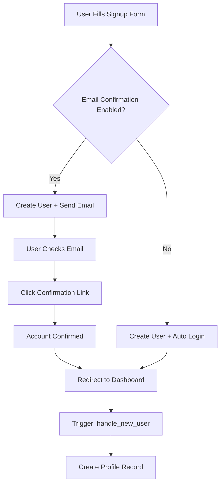

# 🔐 Supabase Authentication Setup Guide

## 🚨 **Current Issues & Solutions**

### **Issue 1: No Email Verification Received**

**Why this happens:**
- Supabase by default requires email confirmation
- In development, emails might not be sent or go to spam
- Email provider might not be configured

**Solutions:**

#### **Option A: Disable Email Confirmation (Development Only)**

1. Go to: https://supabase.com/dashboard/project/pqnjcombcbdruhixbabf/auth/providers
2. Scroll down to **"Email"** provider
3. Find **"Confirm email"** toggle
4. **Disable it** for development
5. Click **Save**

⚠️ **Warning**: Only do this in development. Re-enable for production!

#### **Option B: Configure Email Templates (Production)**

1. Go to: https://supabase.com/dashboard/project/pqnjcombcbdruhixbabf/auth/templates
2. Customize the **"Confirm signup"** email template
3. Make sure your domain is whitelisted
4. Test email delivery

#### **Option C: Use Custom SMTP (Recommended for Production)**

1. Go to: https://supabase.com/dashboard/project/pqnjcombcbdruhixbabf/settings/auth
2. Scroll to **"SMTP Settings"**
3. Configure with your email provider:
   - **SendGrid**
   - **Mailgun**
   - **Amazon SES**
   - **Resend**

---

### **Issue 2: 400 Error on Token Endpoint**

**Why this happens:**
- The app tries to auto-login after signup, but the user hasn't confirmed their email
- Supabase returns no session when email confirmation is pending

**Fix:** ✅ **Already Fixed in Code**

The updated `Auth.tsx` now properly handles both scenarios:
- **With email confirmation**: Shows "Check your email" message
- **Without email confirmation**: Logs user in automatically

---

### **Issue 3: Browser Extension Error**

```
Uncaught (in promise) Error: A listener indicated an asynchronous response by returning true, 
but the message channel closed before a response was received
```

**Why this happens:**
- This is caused by a browser extension (not your code)
- Common culprits: ad blockers, password managers, Chrome extensions

**Solutions:**
1. Test in **Incognito/Private mode**
2. Disable browser extensions temporarily
3. This error is harmless and won't affect users

---

## ✅ **Recommended Setup for Development**

### **Step 1: Disable Email Confirmation**

```bash
# Navigate to Supabase Dashboard
# https://supabase.com/dashboard/project/pqnjcombcbdruhixbabf/auth/providers

# Find "Email" provider → Disable "Confirm email"
```

### **Step 2: Update Site URL**

```bash
# Go to: https://supabase.com/dashboard/project/pqnjcombcbdruhixbabf/auth/url-configuration

# Set these values:
Site URL: http://localhost:5173
Additional Redirect URLs:
  - http://localhost:5173/**
  - http://localhost:5173/dashboard
  - http://localhost:5173/auth
```

### **Step 3: Test Authentication Flow**

1. **Sign Up**:
   ```
   Email: test@example.com
   Password: test123
   Full Name: Test User
   ```

2. **Check Dashboard**:
   - Should redirect to `/dashboard` immediately (no email confirmation)
   - Profile should be created in `profiles` table

3. **Sign Out & Sign In**:
   - Test login with same credentials
   - Should work without email confirmation

---

## 🚀 **Production Setup**

### **Step 1: Enable Email Confirmation**

```bash
# Go to: https://supabase.com/dashboard/project/pqnjcombcbdruhixbabf/auth/providers
# Enable "Confirm email" for security
```

### **Step 2: Configure Custom SMTP**

Example with **Resend** (recommended):

1. Sign up at https://resend.com
2. Get API key
3. Go to Supabase → Settings → Auth → SMTP
4. Configure:
   ```
   SMTP Host: smtp.resend.com
   SMTP Port: 587
   SMTP User: resend
   SMTP Password: [Your Resend API Key]
   Sender Email: noreply@yourdomain.com
   Sender Name: EERA OS
   ```

### **Step 3: Customize Email Templates**

1. Go to: https://supabase.com/dashboard/project/pqnjcombcbdruhixbabf/auth/templates
2. Edit **"Confirm signup"** template:

```html
<h2>Welcome to EERA OS!</h2>
<p>Thanks for signing up! Please confirm your email address by clicking the button below:</p>
<a href="{{ .ConfirmationURL }}">Confirm Email</a>
```

### **Step 4: Update Production URLs**

```bash
# Site URL: https://your-app.vercel.app
# Redirect URLs:
#   - https://your-app.vercel.app/**
#   - https://your-app.vercel.app/dashboard
#   - https://your-app.vercel.app/auth
```

---

## 🧪 **Testing Checklist**

- [ ] **Sign Up** - New user can create account
- [ ] **Email Received** - Confirmation email arrives (if enabled)
- [ ] **Email Link Works** - Clicking link confirms account
- [ ] **Auto Profile Creation** - Profile created in database via trigger
- [ ] **Sign In** - Existing user can log in
- [ ] **Password Reset** - User can reset forgotten password
- [ ] **Protected Routes** - Dashboard requires authentication
- [ ] **Session Persistence** - User stays logged in after refresh

---

## 🔧 **Quick Fixes**

### **Reset User for Testing**

If you need to delete a test user and start fresh:

```sql
-- Delete from Supabase SQL Editor
DELETE FROM auth.users WHERE email = 'test@example.com';
DELETE FROM public.profiles WHERE email = 'test@example.com';
```

### **Check if User Exists**

```sql
-- Check auth.users table
SELECT id, email, email_confirmed_at, created_at 
FROM auth.users 
WHERE email = 'your-email@example.com';

-- Check profiles table
SELECT id, email, full_name, onboarding_completed 
FROM public.profiles 
WHERE email = 'your-email@example.com';
```

### **Manually Confirm Email**

```sql
-- Manually confirm a user's email (dev only)
UPDATE auth.users 
SET email_confirmed_at = NOW() 
WHERE email = 'test@example.com';
```

---

## 📊 **Understanding the Auth Flow**



---

## 🐛 **Common Errors & Fixes**

### **Error: "User already registered"**
**Fix**: The email is already in use. Use a different email or delete the existing user.

### **Error: "Invalid login credentials"**
**Fix**: 
1. Check if email is confirmed
2. Verify password is correct
3. Check if user exists in `auth.users`

### **Error: "Email link is invalid or has expired"**
**Fix**: Confirmation links expire after 24 hours. Request a new one.

### **Error: "Failed to fetch"**
**Fix**: 
1. Check internet connection
2. Verify `VITE_SUPABASE_URL` is correct
3. Check Supabase project is not paused

---

## 📞 **Need Help?**

- **Supabase Auth Docs**: https://supabase.com/docs/guides/auth
- **Auth Helpers**: https://supabase.com/docs/guides/auth/auth-helpers
- **Email Templates**: https://supabase.com/docs/guides/auth/auth-email-templates

---

## 🎯 **Next Steps**

1. ✅ **Apply the code fixes** (already done)
2. 🔧 **Disable email confirmation** for development
3. 🧪 **Test the auth flow** end-to-end
4. 📧 **Configure SMTP** before production
5. 🚀 **Deploy to Vercel** with confidence!


